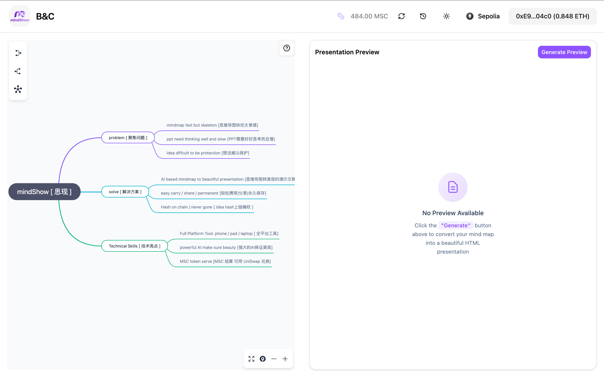
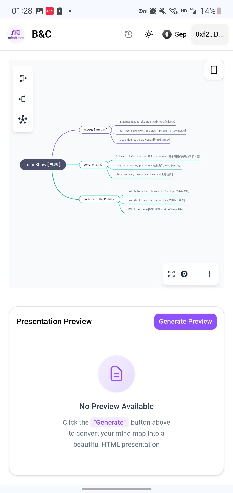
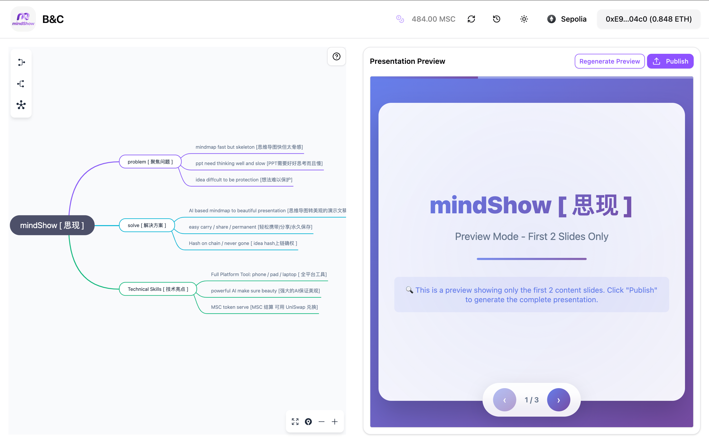
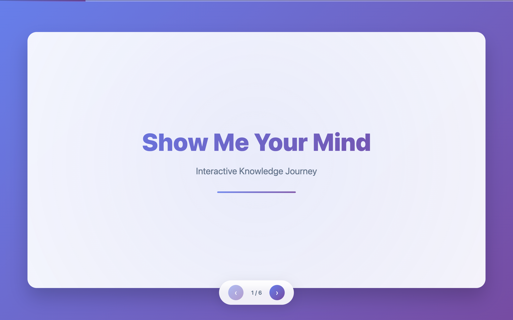
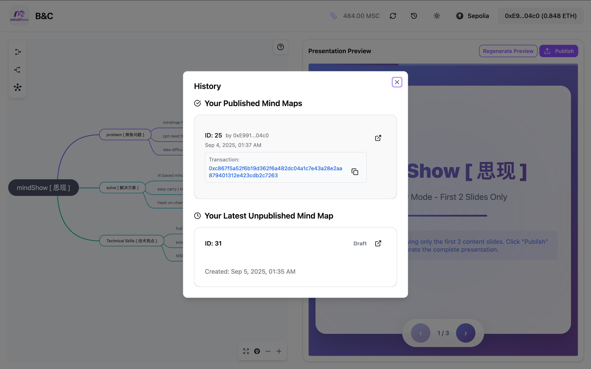
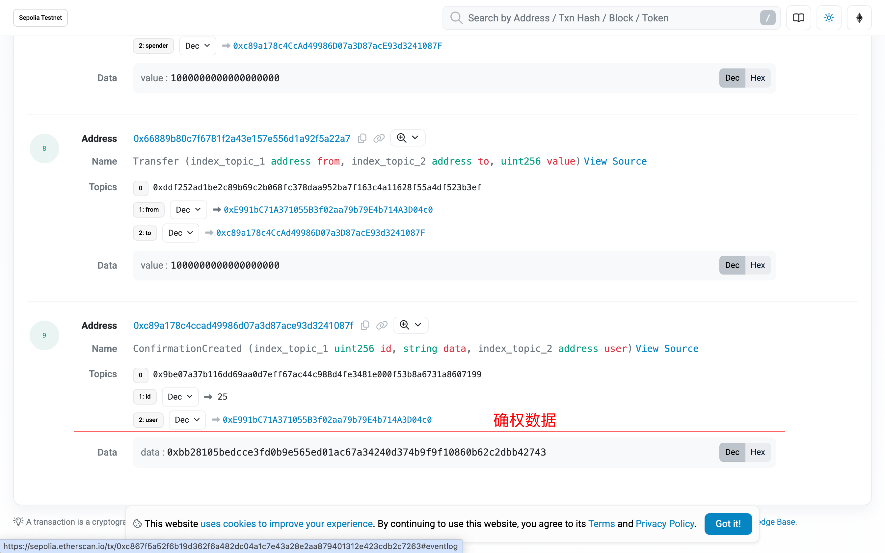
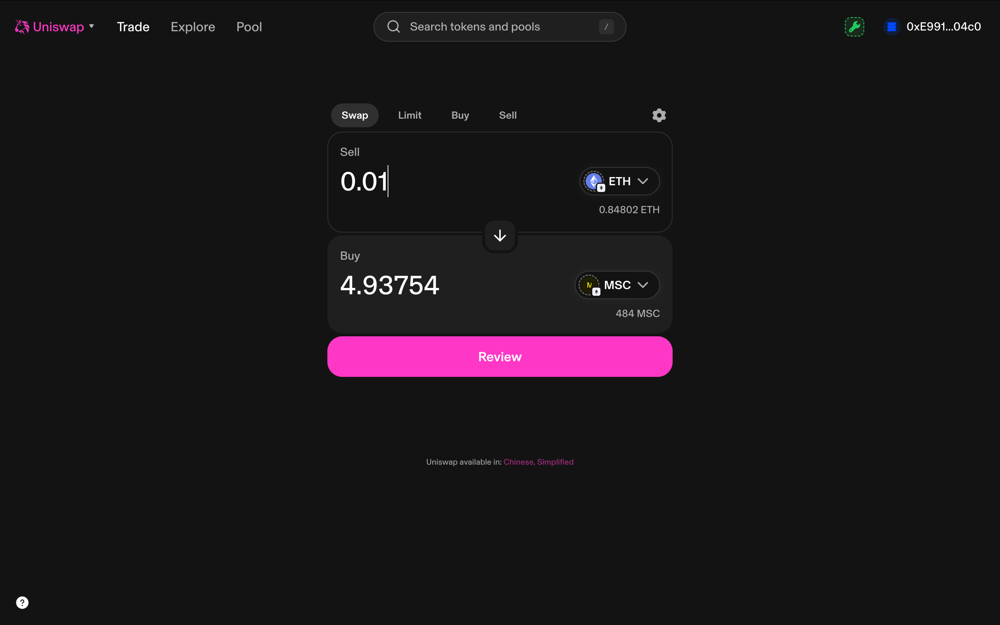
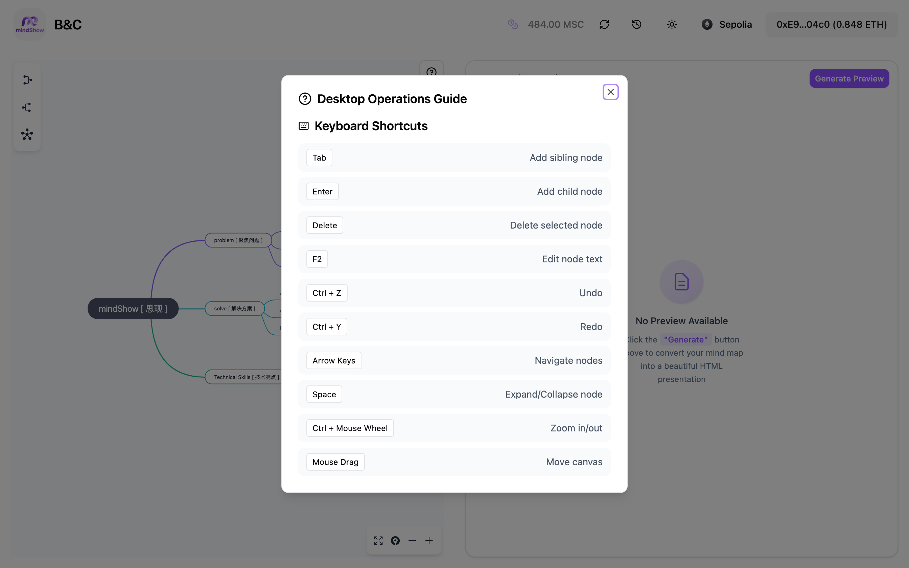

<!--
 * @Author: Mr.Car
 * @Date: 2025-09-04 23:18:35
-->
# MindShow 思现
思维之显化 / 思考于当下

## 1. 聚焦问题

当我们有想法需要公开演讲的时候，常常面临如下问题：

1. 用思维导图可以清晰的展示我们的思路，但是太过于抽象，视觉上太“骨感”，很难保证听众和演讲者的同频
2. 用ppt需要大量的时间准备，而且不易于分享，不易于分发，ppt的演示效果也取决于制作人的水平
3. 最终形成的idea很难确权，极容易被剽窃，法律上受“著作权”，执行上没有抓手

## 2. 解决方案

MindShow 采用了 AI + blockchain 的技术方案，有效解决以上问题：

1. 一套全平台的 渐进式 web应用，让你在手机， pad， 电脑上都能够随时随地将 mindmap 一键转化为精美的 presentation

[laptop/pad:] 
[phone：] 

2. 可以轻松携带，分享，永久保存

3. 所有发布过后的数据都会将hash上链，确保无法篡改，保护idea的著作权

## 3. 使用方式

### 获取MSC
需要用 MSC支付发布费用，才可以确权并独立预览，获取MSC有两种方式：
1. 在 uniswap 中用 sepolia ETH 兑换 MSC

> 搜索代币 Mind Show Coin (MSC)：[0x66889B80C7F6781F2a43E157e556d1A92F5A22A7](https://sepolia.etherscan.io/token/0x66889B80C7F6781F2a43E157e556d1A92F5A22A7)

2. 联系 `Mr.Car / Bape` 获取空投

> Mr.Car github：https://github.com/MrCare
>
> json0755 github：https://github.com/json0755

### 技术亮点

1. 全部的mindmap功能操作

2. 基于复杂提示词工程的AI模型支持，确保生成内容的稳定美观
3. 基于ERC2612的确权合约，保障`idea著作权`
4. 响应式设计，完美的三端兼容