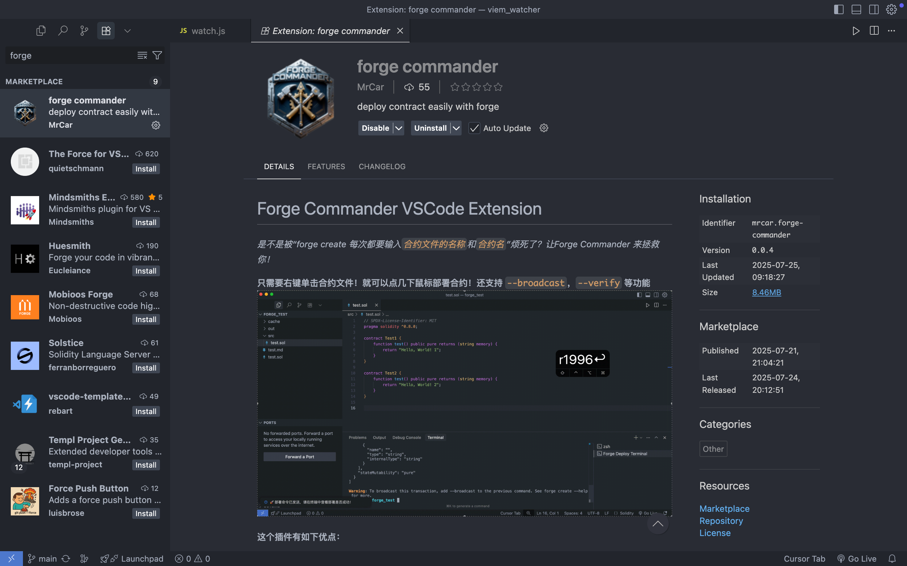

<!--
 * @Author: Mr.Car
 * @Date: 2025-09-04 18:40:14
-->
# 作品名称: ForgeCommander

## 作品简介

ForgeCommander 是一个 Cursor / Vscode 插件，可以非常丝滑地部署合约，完成合约的测试网部署，etherscan 验证，部署账户切换。

1. 安全：基于cast wallet 进行账户管理，插件不访问用户私钥，而是通过 --account 参数访问用户账户
2. 丝滑：通过右键单击的方式进行合约部署，简化命令行操作
3. 强大：支持运行 forge script / forge test / forge create / forge inspect，完美替代繁琐的命令行

## 作品代码仓库

1. https://github.com/MrCare/forge-commander

## 黑客松资料

1. 作品链接（VScode）：marketplace.visualstudio.com/items?itemName=MrCar.forge-commander
2. 作品连接（Cursor）：https://open-vsx.org/extension/MrCar/forge-commander
3. 作品详情：[https://github.com/MrCare/forge-commander/blob/main/README.md](https://github.com/MrCare/forge-commander/blob/main/README.md)

## 成员

Mr.Car
- 产品设计 / 架构设计 / 开发
- github：https://github.com/MrCare

## ERC20 地址(用于团队接收奖励)
0xE991bC71A371055B3f02aa79b79E4b714A3D04c0